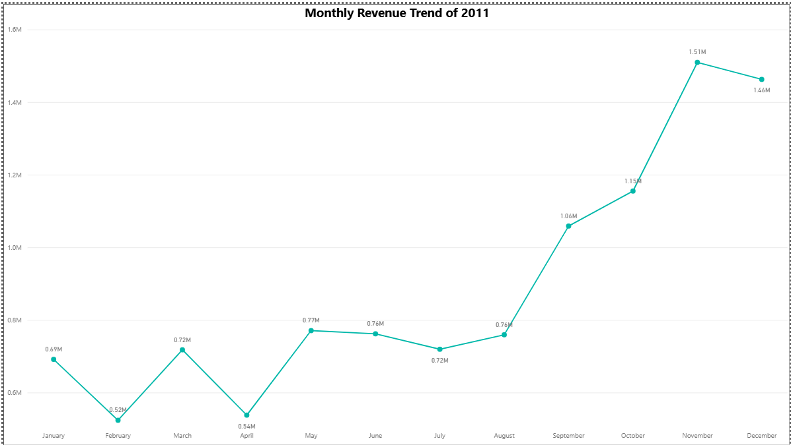
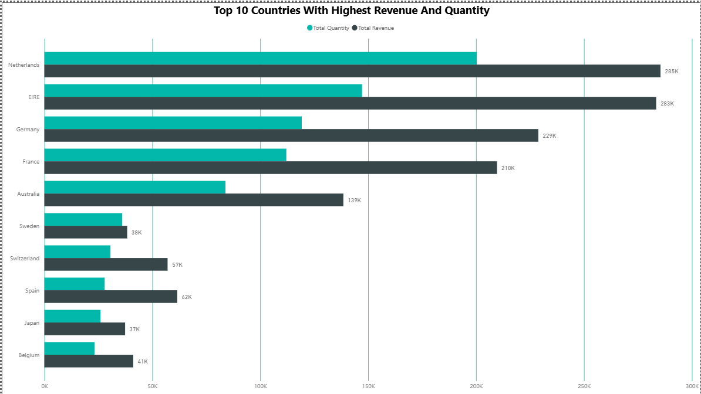
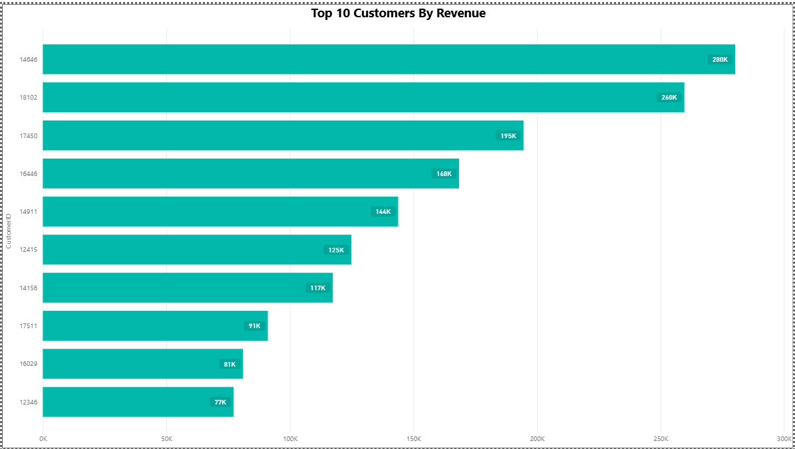
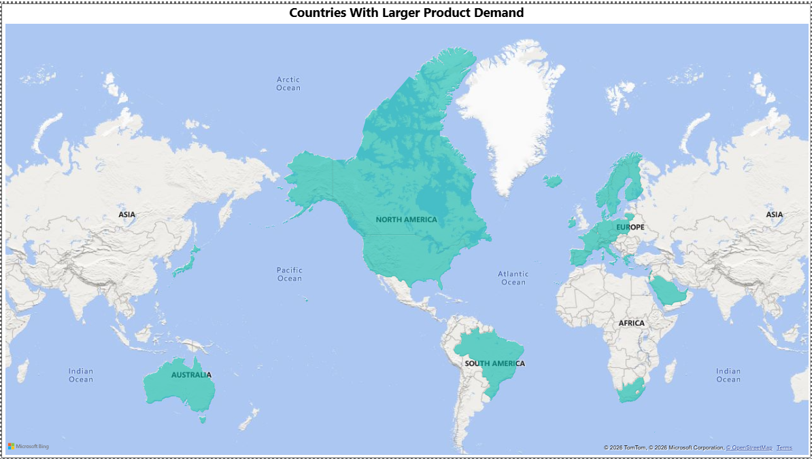

# Tata iQ Data Visualisation — Forage Job Simulation

## Overview
As part of the Tata iQ Data Visualisation Job Simulation on Forage, I analysed an online 
retail dataset containing 500K+ transactions to help simulated CEO and CMO stakeholders 
make data-driven business decisions. The project involved framing business questions, 
selecting appropriate visualisations, cleaning data, building a Power BI dashboard, 
and presenting findings to senior leadership

## Tools Used
- Power BI
- Power Query (data cleaning)

---

## Business Questions Framed
### CEO
- What is the overall monthly revenue trend for 2011, and which quarters show consistent 
  peaks or dips?
- Which countries outside the UK contribute the highest revenue, and which regions are 
  underperforming?
- What share of total revenue is driven by the top 20% of customers, and has that 
  concentration changed over time?

### CMO
- Which markets have a high customer count but declining revenue, indicating a gap between 
  reach and conversion?
- Who are the top performing customers by revenue, which regions do they belong to, and 
  what do they frequently purchase?
- What percentage of customers are repeat buyers versus one-time buyers, and which 
  high-value one-time buyers show re-engagement potential?
- Which products consistently appear in repeat customer orders, and which have high 
  quantity sold but low reorder rates?

 ---

## Data Cleaning
Before building any visuals, the raw dataset was cleaned in **Power Query** inside Power BI:
- Removed all transactions where **Quantity < 1** (returns and cancellations)
- Removed all transactions where **Unit Price < £1** (erroneous entries)
- Changed CustomerID data type from numeric to **Text** for correct categorical treatment
- Created a **Revenue measure** using DAX:
```DAX
Revenue = SUMX('Online Retail', 'Online Retail'[Quantity] * 'Online Retail'[UnitPrice])
```

---

## Dashboard Preview


## Dashboard File

[Download Power BI Dashboard](dashboard/tata_forage_full_dashboard.pbix)

---

## Insights

### Monthly Revenue Trend


- Revenue remained relatively stable between January and August, ranging from 0.52M to 0.77M
- A sharp upward trend begins in September, peaking at **1.51M in November** — driven by 
  seasonal Q4 holiday demand
- December shows a slight dip to 1.46M, likely due to incomplete data for that month
- **Recommendation:** The business should plan inventory, staffing and logistics around 
  this predictable Q4 surge every year


### Top 10 Countries


- **Netherlands and EIRE** are the top two international markets at 285K and 283K revenue 
  respectively
- Germany and France follow closely, making Europe the dominant international region
- Sweden, Japan and Belgium show significantly lower revenue despite being established markets
- **Recommendation:** Prioritise Netherlands, EIRE, Germany and France for international 
  marketing investment. Investigate underperforming markets for targeted campaign opportunities

### Top 10 Customers


- Customer **14646** is the single highest value customer generating **280K** in revenue
- The top 2 customers (14646 and 18102) together contribute over **540K** — representing 
  significant revenue concentration
- **Recommendation:** The CMO should build a dedicated retention and loyalty programme 
  for these top customers. Losing even one would have a measurable negative impact on 
  overall revenue

### Regional Demand Map


- Product demand is heavily concentrated in **Europe and Australia**
- Asia, Africa and South America show little to no presence on the demand map
- This suggests the business is currently very Europe-centric in its customer reach
- **Recommendation:** The CEO should explore whether Asia and other regions represent 
  untapped growth opportunities.

---


## Certificate
Issued by Forage — March 2026
https://www.theforage.com/completion-certificates/ifobHAoMjQs9s6bKS/MyXvBcppsW2FkNYCX_ifobHAoMjQs9s6bKS_69bea5ba9cb059337c6fc120_1774260142037_completion_certificate.pdf
